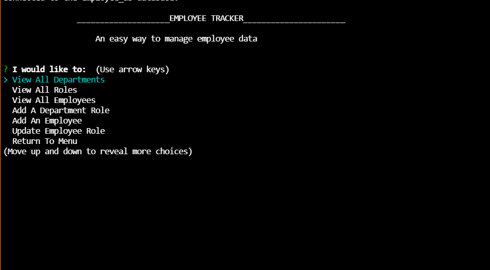
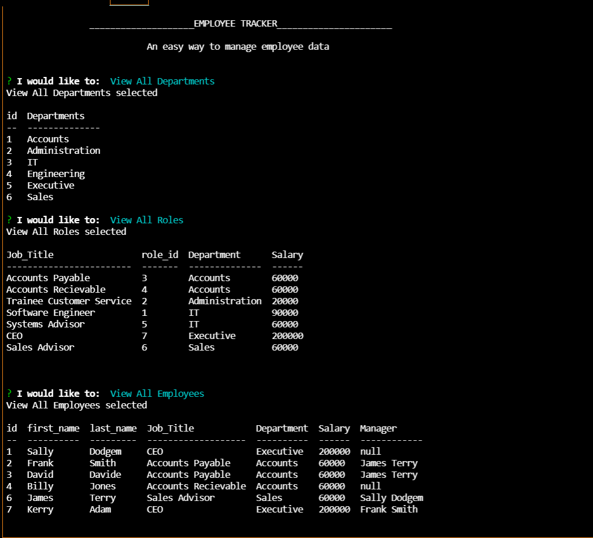
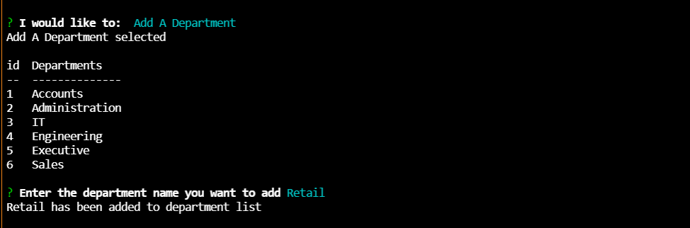

# Employee-Tracker

## Description
### Project Aim ###
To create a command line application that allows the user to input details about their business structure and employees and view and make changes to that info.

### What I Learnt ###
Connecting MySQL to Inquirer, various MySQL queries, how to use prepared statements for query values.

## Deployment
You can view the [youtube walkthrough link](https://youtu.be/PVvWmxnKlrc) here. 

## Table of Contents
- [Description](#description)
- [User Story](#user-story)
- [Screenshots](#screenshots)
- [Installation](#installation)
- [Features](#features)
- [Technology](#technology)
- [Contributors](#contributors)
- [Acknowledgements](#acknowledgements)
- [Testing](#testing)
- [License](#license)
- [Questions](#questions)

## User Story
GIVEN a command-line application that accepts user input

WHEN I start the application

THEN I am presented with the following options: view all departments, view all roles, view all employees, add a department, add a role, add an employee, and update an employee role

WHEN I choose to view all departments

THEN I am presented with a formatted table showing department names and department ids

WHEN I choose to view all roles

THEN I am presented with the job title, role id, the department that role belongs to, and the salary for that role

WHEN I choose to view all employees

THEN I am presented with a formatted table showing employee data, including employee ids, first names, last names, job titles, departments, salaries, and managers that the employees report to

WHEN I choose to add a department

THEN I am prompted to enter the name of the department and that department is added to the database

WHEN I choose to add a role

THEN I am prompted to enter the name, salary, and department for the role and that role is added to the database

WHEN I choose to add an employee

THEN I am prompted to enter the employee’s first name, last name, role, and manager, and that employee is added to the database

WHEN I choose to update an employee role

THEN I am prompted to select an employee to update and their new role and this information is updated in the database

## Screenshots

## Installation
You will need: 
node.js, Inquirer, MySQL2, 

1. Clone the repo to your computer and open it with VS Code
2. Install Node.js if not already installed
4. Create a .env file in the root directory and input your MySQL login details in it

3. Run 'npm i' in Terminal inside VS Code 
5. Run node index.js in the Terminal to start program

## Features
- Add, delete and update Employee information
- Add and view all departments
- Add and view all department roles

## Technology
- Inquirer
- MySQL
- Console.Table
- Node.js

## Contributors
[Zachary Hobba](https://github.com/HobbaZ)

You can also contribute by opening a pull request or submitting an issue

## Acknowledgements

[https://www.w3schools.com/sql/default.asp](https://www.w3schools.com/sql/default.asp)

[https://stackoverflow.com/questions/4249079/mysql-delete-all-rows-containing-string-foo-in-table-bar](https://stackoverflow.com/questions/4249079/mysql-delete-all-rows-containing-string-foo-in-table-bar)

[https://www.sqlservertutorial.net/sql-server-basics/sql-server-self-join/](https://www.sqlservertutorial.net/sql-server-basics/sql-server-self-join/)

[https://www.tutorialkart.com/nodejs/nodejs-mysql-delete/](https://www.tutorialkart.com/nodejs/nodejs-mysql-delete/)

## Testing
No tests created

## License

MIT

**Copyright 2021 Zachary Hobba**

Permission is hereby granted, free of charge, to any person obtaining a copy of this software and associated documentation files (the "Software"), to deal in the Software without restriction, including without limitation the rights to use, copy, modify, merge, publish, distribute, sublicense, and/or sell copies of the Software, and to permit persons to whom the Software is furnished to do so, subject to the following conditions:
The above copyright notice and this permission notice shall be included in all copies or substantial portions of the Software.
    
THE SOFTWARE IS PROVIDED "AS IS", WITHOUT WARRANTY OF ANY KIND, EXPRESS OR IMPLIED, INCLUDING BUT NOT LIMITED TO THE WARRANTIES OF MERCHANTABILITY, FITNESS FOR A PARTICULAR PURPOSE AND NONINFRINGEMENT. IN NO EVENT SHALL THE AUTHORS OR COPYRIGHT HOLDERS BE LIABLE FOR ANY CLAIM, DAMAGES OR OTHER LIABILITY, WHETHER IN AN ACTION OF CONTRACT, TORT OR OTHERWISE, ARISING FROM, OUT OF OR IN CONNECTION WITH THE SOFTWARE OR THE USE OR OTHER DEALINGS IN THE SOFTWARE.

## Questions

Find me on Github at [HobbaZ](https://github.com/HobbaZ)
Email me at [zachobba@gmail.com](zachobba@gmail.com)